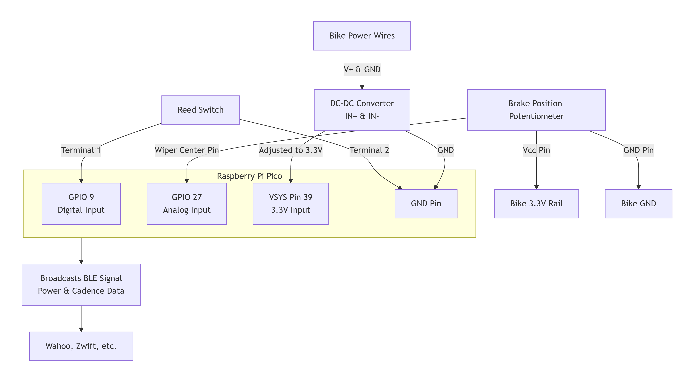
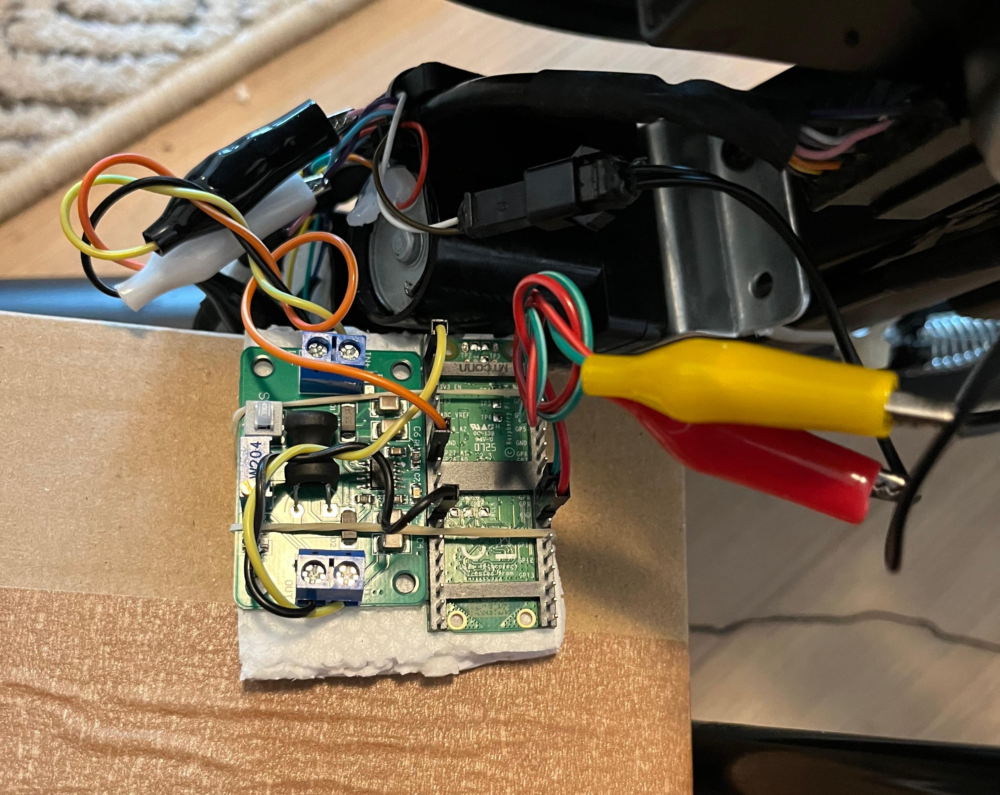

# Operational Setup Guide
## Preparation: Powering the Pico from the Bike
Objective: To make the Raspberry Pi Pico run independently using the bike's internal power supply, eliminating the need for a USB cable.

Materials:

DC-DC Buck Converter (Adjustable, LM2596 variant shown)

Multimeter

Alligator clip test leads

Wire strippers

### Procedure:

**Locate Bike Power:** Inside the bike's electronics compartment, identify the main DC power input wires that run from the wall adapter port to the console. These are typically two wires: one for power (V+, often red) and one for ground (GND, often black). Use the multimeter to confirm the voltage between them as 9V.

**Connect DC-DC Converter:**

1. Using alligator clips, connect the IN+ terminal of the DC-DC converter to the bike's V+ wire. You may need to carefully make a small incision in the wire's insulation to get a good connection.

2. Connect the IN- terminal to the bike's GND wire in the same manner.

**Adjust Output Voltage:**

1. Turn the bike's power on.

2. Use your multimeter to measure the voltage between the OUT+ and OUT- terminals of the converter.

3. Carefully adjust the small potentiometer on the converter board until the multimeter reads a steady 3.3V.

4. Turn the bike off.

**Flash the Pico:**

1. Disconnect the DC-DC converter from the bike.

2. Hold down the BOOTSEL button on the Pico and plug it into your computer via USB. It should appear as a removable drive.

> For a completely clean start, drag and drop the flash_nuke.uf2 file onto the drive to wipe it. Then, to install the base MicroPython firmware, drag the appropriate .uf2 file onto the drive.

3. Once the Pico reboots, copy all python files from the `/operation` folder (including main.py, etc.) to the Pico's root directory. The main.py file will run automatically on boot.

4. Safely eject the Pico and unplug the USB cable. It is now ready to be powered by the bike.

## Final Wiring
Objective: To connect the power source and sensors to the Pico.

### Connections

**Power:**

1. Connect the DC-DC converter's OUT+ terminal to the Pico's VSYS pin (Pin 39).

2. Connect the converter's OUT- terminal to any GND pin on the Pico.

**Resistance Potentiometer:**

1. Locate the 3-pin potentiometer on the bike's brake actuator.

2. Connect its wiper (middle) pin to the Pico's GPIO 27 (Pin 32) using an alligator clip. This is an analog input to read the magnet position.

**Cadence Sensor (Reed Switch):**

1. Tap into the two wires of the bike's original reed switch using alligator clips (make incisions for contact).

2. Connect one wire to a Pico GND pin.

3. Connect the other wire to GPIO 9 (Pin 12). Note: If cadence readings are erratic or zero, swap these two connections; the reed switch is a mechanical sensor but can have polarity sensitivity in some circuits.

4. Final Circuit Diagram:
    

    

**Mounting and Final Power-On**

1. Mount the Circuit: Securely mount the Pico and DC-DC converter to a piece of styrofoam or plastic using rubber bands or zip ties. Then, mount this assembly securely somewhere on the bike's frame where it won't interfere with moving parts.

2. Final Check: Double-check all wiring connections against the schematic.

3. Power On: Plug the bike into mains power and turn it on. The Pico should now be powered from the bike's internal supply via the DC-DC converter.

4. Connect: Open your fitness app (e.g., Wahoo). The Pico should automatically advertise itself as a Bluetooth FTMS (Fitness Machine Service) capable trainer. It should appear as a discoverable device named "PicoPowerMeter". Connect to it.

5. Operate: Start pedaling. The app should now display live, real-time power (watts) and cadence (RPM) data being transmitted from your DIY power meter.

## Troubleshooting
#### Issue: Erratic or false cadence readings

**Cause:** Magnetic interference from the large flywheel magnet or other sources prematurely triggering the reed switch.

**Solution 1:** Cycle the bike's power. This resets the Pico and can clear glitches.

**Solution 2:** Improve shielding around the reed switch with more aluminum foil.

**Solution 3:** Implement a software debounce algorithm in the code to ignore triggers that happen too close together.

#### Issue: No power reading in app

**Check:** Ensure the resistance level potentiometer is wired correctly to the analog pin (GP27). The power calculation depends on this reading to choose the correct k value.

#### Issue: pico doesn't power on

**Check 1:** Verify the DC-DC converter is correctly adjusted to 3.3V and is receiving input power from the bike.

**Check 2:** Ensure the connections from the converter's OUT+ and OUT- are securely connected to VSYS and GND on the Pico, respectively.

#### Issue: App doesn't discover the bluetooth device

**Check 1:** Ensure the all the files in `/operation` directory including main.py code are correctly on the Pico.

**Check 2:** The Pico may need a hard reset (power cycle) after loading the software to start advertising correctly.